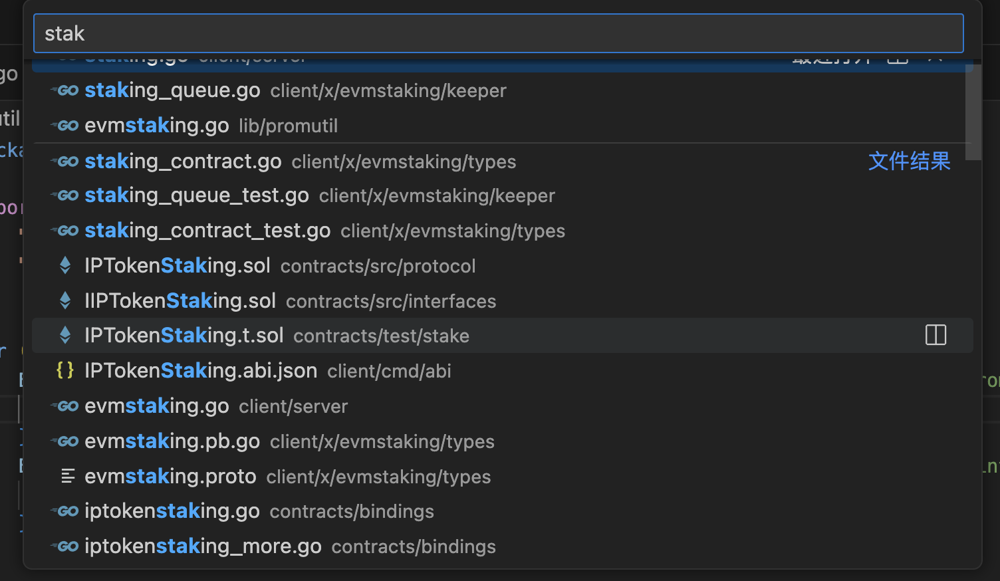
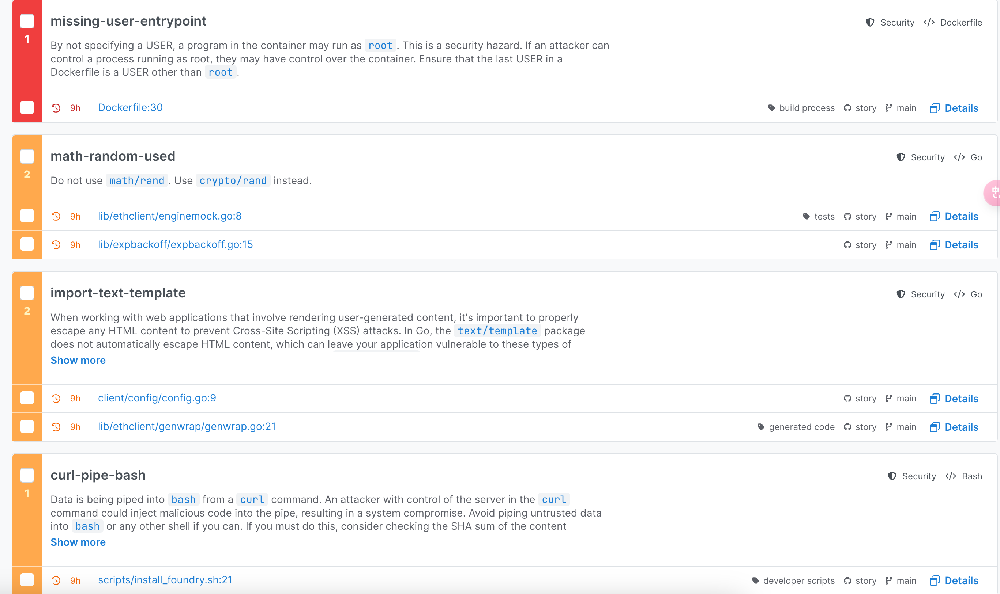

### Targets

End-to-end tests, which means the testing project should contain the whole life cycle of staking:

- all the user(including delegators, active validator, non-active validator) **operations** related to staking.

- all the **codes** related to staking.

After reading the staking specifications, I learn that staking contains the following funciton:

- **Create Validator**:

    - Verify the functionality of creating a validator, including initial staking amount, moniker, and commission rate.

- **Update Validator Commission**:

    - Test the functionality for validators to edit their commission rates.

- **Stake**:

    - Verify the functionality of staking tokens to a validator, including self-delegation and fixed staking periods.

- **Unstake**:

    - Test the functionality of unstaking, including flexible staking and fixed staking periods.

- **Redelegate**:

    - Verify the functionality of moving staked tokens from one validator to another.

- **Set Withdraw Address**:

    - Test the functionality of setting a withdrawal address.

- **Set Reward Address**:

    - Test the functionality of setting a reward address.

### Test Plan

#### Components/Modules:

|Testing Method / Module|/client/server/staking.go|client/x/evmstaking/*/**|contracts/bindings/iptokenstaking.go|
|-|-|-|-|
|Unit Testing|✅|✅|✅|
|Lint|✅|✅|✅|
|Mutation Testing|✅|✅|✅|
|Safe Static Testing|✅|✅|✅|
|Api Testing|✅|✅|✅|
|Performance Testing|✅|✅|✅|

- Unit Testing: 

    - tool: go test

    - statistic: 

        - coverage

        - pass rate

        - time

- Lint:

    - tool: go lint

    - statistic:

        - cyclomatic complexity

        - duplication rate

- Mutation Testing: 

    - tool: 

        - [go-gremlins/gremlins](https://github.com/go-gremlins/gremlins)

        - [gtramontina/ooze](https://github.com/gtramontina/ooze)

    - statistic: 

        - mutation score = killed / total

        - coverage

- Static Testing: 

    - tool: [https://semgrep.dev/](https://semgrep.dev/)

    - statistic: 

        - safety problem number

- Api Testing: 

    - tool: 

        - pytest

        - postman

        - ...

    - statistic:

        - pass rate

- Performance Testing:

    - tool: 

        - locust

        - wrk

        - ...

    - statistic:

        - response time

        - throughout

        - concurrent users

        - tps

        - resource utilization

        - error rate

        - average load time

        - ...

### Report

Let me take a static scan result as an example:

[https://semgrep.dev/orgs/313407040_personal_org/projects/zhengow%2Fstory](https://semgrep.dev/orgs/313407040_personal_org/projects/zhengow%2Fstory)

### Furthermore

- Rich unit testing cases:

    - basic function

    - corner cases

- More static rules:

    - self-defined or open-source rules

    - solidity check: [https://github.com/Decurity/semgrep-smart-contracts](https://github.com/Decurity/semgrep-smart-contracts)

- Other testing method

